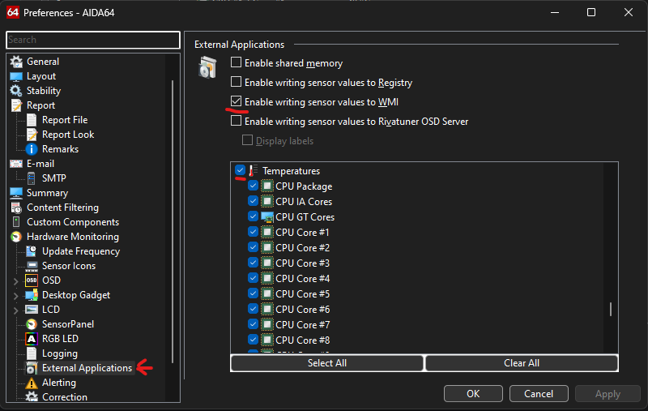

Control the PWM of your laptop cooling pad fan using ESP32 via USB, based on your Windows CPU/GPU temperatures, taken from AIDA64.

### How it works
- Gets temperatures from AIDA64
- Filters them by CPU and GPU sensors
- Takes the maximum int value among all temperatures
- Sends PWM command (`Dimmer {value}` by default) to the serial device

### AIDA64 Preparation
Getting CPU Temperature appeared to be harder on my Windows 11 i9-13900HX than flashing and connecting ESP32! The only working way I found was AIDA64 via WMI. If you can get your CPU Temperature easier - good for you!
- Run AIDA64
- In AIDA64 Preferences->External Applications->Enable writing sensors to WMI
- In AIDA64 Preferences->External Applications0>Enable Temperature sensors
- Keep AIDA64 open

### Serial Device Preparation
Example: [ESP32_Tasmota](docs/ESP32_Tasmota.md)
- Connect your Serial Device via USB
- Attach a device pin to the fan PWM
- Attach the device Ground pin to the fan Ground

### Script Preparation
- Create `.env` and fill it using [.env.example](.env.example)

### Script Execution
#### GUI
- Use pre-built binaries or run [build.cmd](build.cmd)
#### Console
- Run [run.cmd](run.cmd) or `python -m source`
