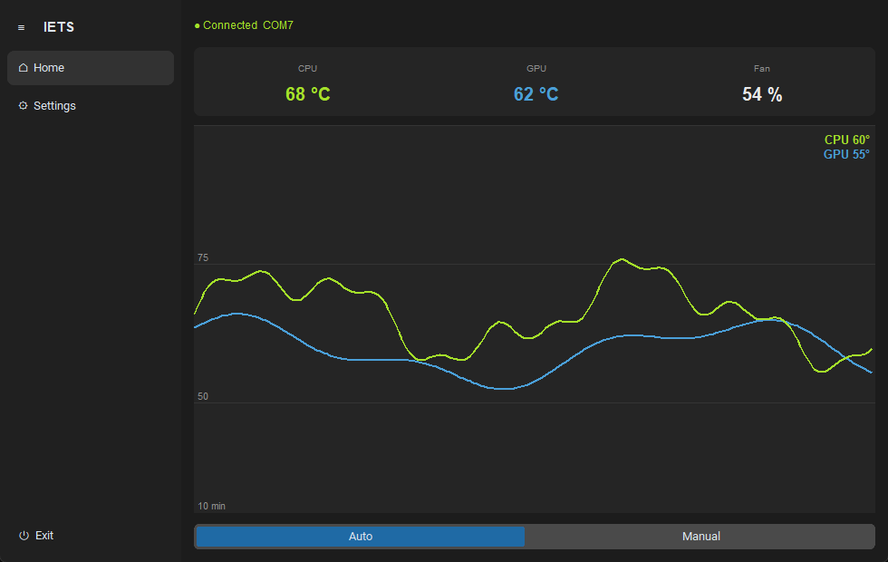
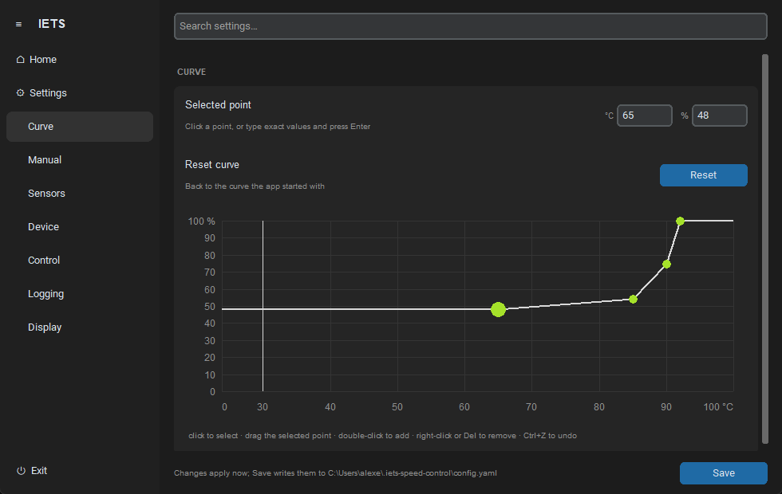
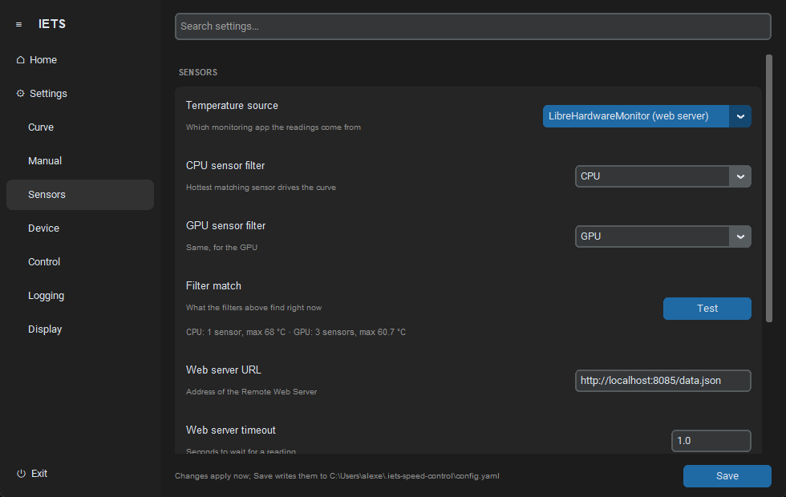
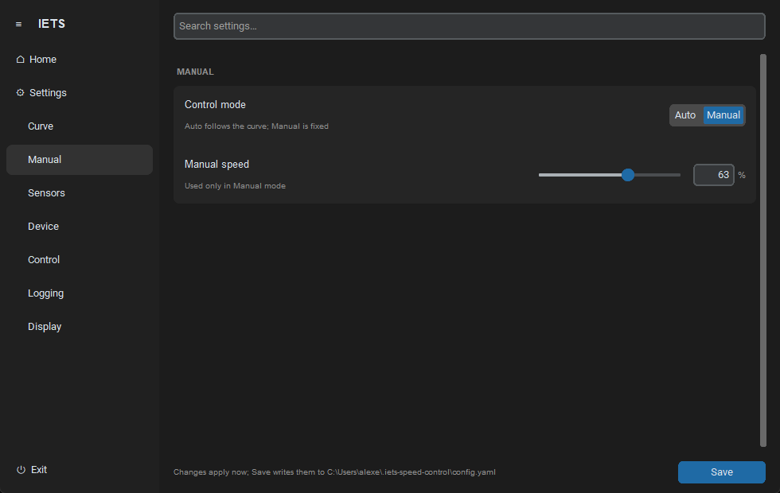
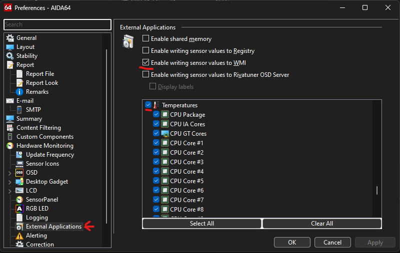

[](https://stand-with-ukraine.pp.ua)
[](https://stand-with-ukraine.pp.ua)
[](https://stand-with-ukraine.pp.ua)
[](https://stand-with-ukraine.pp.ua)

Control the PWM of your laptop cooling pad fan using ESP32 via USB, based on your Windows CPU/GPU temperatures, taken
from AIDA64.



### How it works

- Gets temperatures from AIDA64
- Filters them by CPU and GPU sensors
- Takes the maximum int value among all temperatures
- Sends PWM command (`Dimmer {value}` by default) to the serial device

### The interface

| | |
| --- | --- |
|  | **Curve** — the fan curve. Drag a selected point, double-click to add, `Del` to remove, `Ctrl+Z` to undo. The temperature axis is broken at 30 °C so the range worth editing gets the width |
|  | **Sensors** — the temperature source and the CPU/GPU label filters, with a live count of what each filter matches |
|  | **Manual** — a fixed speed instead of the curve. The mode and the speed are both remembered between runs |

### Temperature Source

Pick one with `sensors.provider` in the config file:

| `sensors.provider` | Source                          | Notes                                                                                               |
|--------------------|---------------------------------|-----------------------------------------------------------------------------------------------------|
| `aida64` (default) | AIDA64 via WMI                  | Paid, must stay running                                                                             |
| `lhm`              | LibreHardwareMonitor via WMI    | Free; falls back to the OpenHardwareMonitor namespace. Not every machine registers the WMI provider |
| `lhm-web`          | LibreHardwareMonitor web server | Free; works where the WMI provider does not                                                         |

Sensor labels differ between sources, so `sensors.cpu_filter` / `sensors.gpu_filter` may need adjusting when you
switch. A filter that matches nothing yields 0 °C, which quietly drives the fan to its minimum — Settings →
Sensors shows how many sensors each filter currently matches.

If the source itself stops answering — AIDA64 closed, LibreHardwareMonitor's web server unreachable — the tray
icon turns red and Home says which source went quiet. The fan keeps running on the curve's floor until it
comes back.

#### AIDA64 Preparation

Getting CPU Temperature appeared to be harder on my Windows 11 i9-13900HX than flashing and connecting ESP32! The only
working way I found was AIDA64 via WMI. If you can get your CPU Temperature easier - good for you!

- Run AIDA64
- In AIDA64 Preferences->External Applications->Enable writing sensors to WMI
- In AIDA64 Preferences->External Applications0>Enable Temperature sensors
- Keep AIDA64 open



#### LibreHardwareMonitor Preparation

Common to both providers below:

- Run LibreHardwareMonitor as administrator — reading CPU temperatures needs kernel driver access
- Keep it open

Sensor coverage is per-chip, not universal. LibreHardwareMonitor inherits its hardware support from
OpenHardwareMonitor, whose [documentation](https://openhardwaremonitor.org/documentation/) enumerates the
supported CPU cores, mainboard chips (ITE, Fintek, Nuvoton, Winbond), GPUs, drives and fan controllers one by
one. If your chip is not on that list, no interface will produce a temperature for it — check what the
LibreHardwareMonitor window itself shows before blaming this app.

##### Via WMI (`sensors.provider: lhm`)

Needs nothing beyond running as administrator: LibreHardwareMonitor publishes sensors to WMI on its own, under
the `root\LibreHardwareMonitor` namespace (`root\OpenHardwareMonitor` is tried as a fallback, and the original
interface is described in
[OpenHardwareMonitor-WMI.pdf](http://openhardwaremonitor.org/wordpress/wp-content/uploads/2011/04/OpenHardwareMonitor-WMI.pdf)).

Not every machine gets it. The namespace is registered at runtime, and on some systems it never appears even
with the app elevated and reporting temperatures in its own window — in that case the provider logs
`no temperature sensors found` and you want the web server below instead. Check yours with:

```powershell
Get-CimInstance -Namespace root/LibreHardwareMonitor -ClassName Sensor | Where-Object SensorType -eq Temperature
```

A list of sensors means the `lhm` provider will work. `The target namespace does not exist` means it will not,
no matter how the app is started.

Sensor labels here are the bare names LibreHardwareMonitor shows, such as `CPU Package` or `GPU Hot Spot`.

##### Via the web server (`sensors.provider: lhm-web`)

Works wherever the app itself works, since it bypasses WMI entirely.

- Enable Options -> Remote Web Server -> Run
- Point `sensors.lhm_web.url` at it — default `http://localhost:8085/data.json`
- Raise `sensors.lhm_web.timeout` if the machine is slow to answer
- If you turned on Remote Web Server -> Authentication, set `sensors.lhm_web.username` and `.password` to match

Authentication is HTTP Basic (LibreHardwareMonitor serves the realm `Libre Hardware Monitor` and answers `401`
on a mismatch). The credentials are sent with the first request rather than after a challenge, and they travel
in plain base64 — keep the server on `localhost` or a trusted network. Wrong credentials are reported once per
poll as `rejected the credentials`, and any `user:password@` embedded in the URL is stripped from the log.

Labels are `<hardware>/<sensor>`, for example `NVIDIA GeForce RTX 4090 Laptop GPU/GPU Hot Spot`. Open
`sensors.lhm_web.url` in a browser to see the exact labels your machine reports.

Keep the filters narrow. LibreHardwareMonitor reports two kinds of entry under the same Temperature type that
are not live temperatures: `Distance to TjMax`, which *falls* as the chip heats up, and fixed limits such as
`Critical Temperature` or `Thermal Sensor High Limit`. A filter that catches either drives the fan from the
wrong number — a `Distance to TjMax` of 60 on an idle CPU would spin the fan up for nothing. The defaults
`cpu_filter: CPU` and `gpu_filter: GPU` avoid both.

### Serial Device Preparation

Example: [ESP32_Tasmota](docs/ESP32_Tasmota.md)

- Connect your Serial Device via USB
- Attach a device pin to the fan PWM
- Attach the device Ground pin to the fan Ground

### Configuration

Everything is optional: without a config file the app runs on its defaults.

- Settings live in `%USERPROFILE%\.iets-speed-control\config.yaml`
- Only values you changed are written there — see [CONFIG.md](CONFIG.md) for the full schema
- Every setting is editable in the GUI, so the file is a convenience rather than a requirement:
  change what you need, then **Save** in the settings footer

### Script Execution

#### GUI

- Run `uv run iets-speed-control-gui`
- **Home** shows the connection state, live CPU/GPU/fan values and a temperature history graph
  (ten minutes by default, adjustable in Settings -> Display)
- **Settings** covers every configuration key, one card per section, with a search box across them:
  - **Curve** is the fan curve editor. The temperature axis is broken at 30 °C: below that nothing
    interesting happens, so it is squashed into a narrow band and the rest of the width goes to the
    range worth editing. Click a point to select it, then drag it to move it;
    double-click to add, right-click or `Del` to remove, `Ctrl+Z` to undo. Undo is per session and
    is never written to the config file. Neighbouring points follow along so the curve stays
    monotonic, as in MSI Afterburner
  - **Sensors** picks the temperature source and the CPU/GPU label filters, and shows how many
    sensors each filter currently matches — a filter matching nothing reads 0 °C
  - **Device** holds the serial settings; they take effect on **Reconnect**
  - **Control**, **Logging** and **Display** hold the tuning, log level, graph timeline and the
    start-minimized and minimize-to-tray switches
- The left rail collapses to icons with the `≡` button
- Changes apply as soon as they validate; a bad value is refused with the reason under the field
- **Save** writes the current state to the config file
- Starts minimized to the tray, and minimizing hides it there; both are switchable in
  Settings -> Display. The close button exits
- The window remembers its size and position, and ignores a saved position that is no longer on the
  desktop

#### Console

- Run `uv run iets-speed-control`

#### Running it without cloning

`uvx` fetches, builds and runs it in one step, leaving nothing behind but its own cache:

```
uvx --from git+https://github.com/ALERTua/iets-speed-control iets-speed-control-gui
```

Swap the last word for `iets-speed-control` to get the console version. Pin a revision by appending
`@main` or `@<tag>` to the URL.

#### Launching the GUI without a console window

`iets-speed-control-gui.exe` is built as a GUI-subsystem program and has no console of its own. The
console window you get from `uv run iets-speed-control-gui` belongs to **`uv`**, which is a console
program itself. Either of these avoids it:

```
uvw run -m src.iets_speed_control.entrypoints.gui
```

### Seeing what it is doing

**Nothing is written to disk by default.** To watch the app work, run the console entrypoint — it prints
every reading and every change to the fan:

```
uv run iets-speed-control
```

```
2026-07-31 22:45:22 | INFO | iets_speed_control.controller | CPU: 79, GPU: 88. Dimmer: 75 -> 72
```

Launched without a console the GUI has nowhere to print, so if you need a record of a GUI session, turn a
log file on — Settings → Logging → **Use default**, or set `logging.file` to a path yourself. It rotates at
1 MB and keeps three of them.

- `logging.level` takes `DEBUG` / `INFO` / `WARNING` / `ERROR` / `CRITICAL`. `DEBUG` adds every reading and
  every smoothing decision; `INFO` reports only what changed
- Third-party libraries (`asyncio`, `wmi`, `comtypes`, `PIL`) stay at `WARNING` whatever you set, so raising
  the level shows this app's own detail rather than library noise
- Both settings apply immediately — no restart
